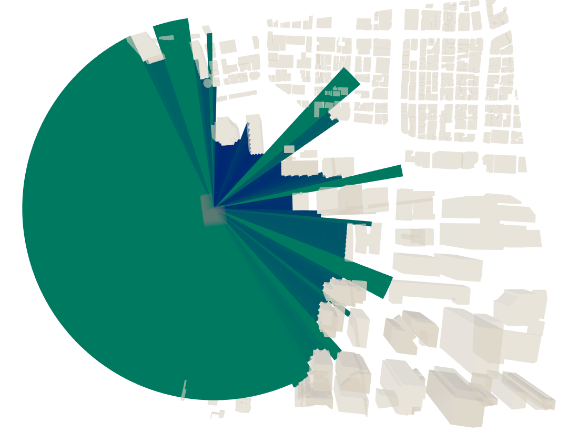

# View Radius

Calculate the area visible from a building mass at a certain height.

|Input Name|Type|Description|
|---|---|---|
|Height|number|The height at which to test the view.|
|Max Radius|number|The maximum radius for raycasting.|

 

|Output Name|Type|Description|
|---|---|---|
|View Score|Number|The total area of the isovist at this height.|

